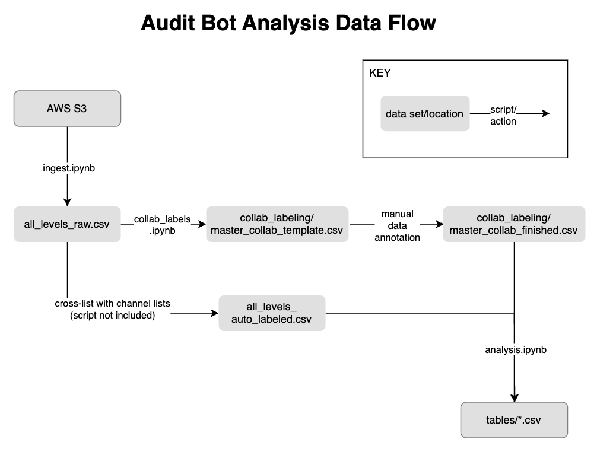
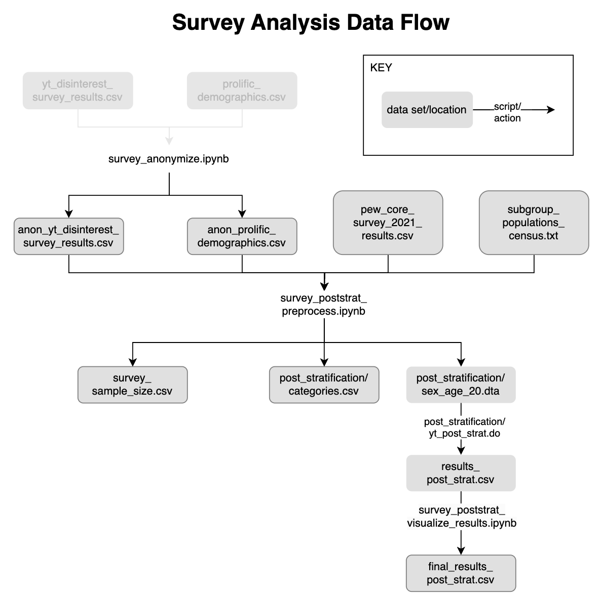

# How to Train Your YouTube Recommender to Avoid Unwanted Videos

## Table of Contents

1. [Quick synopsis](#quick-synopsis)
2. [Project overview](#project-overview)
3. [Included files](#included-files)
4. [Running instructions](#running-instructions)
5. [Manual data annotation](#manual-data-annotation)

## Quick synopsis

**Can YouTube users effectively remove unwanted recommendations?** We simulated users of a variety of interests and disinterests to answer this question. We then run a user survey to understand how users interact with the features that we tested. 

**We find that the "Not interested" button worked best**: using this button **removed 97% of videos from an unwanted topic on the homepage**.  Unfortunately, we estimate from the survey that **44% of the YouTube adult population is unaware that this button exists**.

**This work was published in [ICWSM 2024](https://arxiv.org/abs/2307.14551).**

This repository contains code for data collection and analysis related to the project. It is currently under review (Revise and Resubmit) at ICWSM. You can find slides for presentations and [here (~5 minutes)](https://docs.google.com/presentation/d/1Tr8CHOl5Ehc8TvKqfdxqDvD67frDe9mRM_j7JEhSUN4/edit#slide=id.g20c8997232a_0_0) and [here (~40 minutes)](https://docs.google.com/presentation/d/1xPxY9KAEN_cKlmAsYtw5mFL0FOOKX1wAD58GBENwLEU/edit#slide=id.g1fdd7edca8c_0_865).


## Project overview

Can YouTube users effectively remove unwanted recommendations? We simulated users of a variety of interests and disinterests to answer this question. Broadly, these sock puppets first purposely populate their feed with videos from this unwanted topic ("stain phase"); Then, they take on one of a variety of strategies to try to eliminate such videos from being recommended ("scrub phase"). These strategies correspond to different features on YouTube that one could use to indicate disinterest towards certain videos, such as the "Not Interested" button, the "Dislike" button, and the "Delete from watch history" button. We collect data on how recommendations change throughout these phases in order to characterize how well YouTube's recommendation system responds to these sock puppets' various interactions with the system. 

### YouTube audit bot pipeline


This project uses the Selenium web testing software to simulate users. It uses the [undetected-chromedriver](https://github.com/ultrafunkamsterdam/undetected-chromedriver)  package to avoid bot detection. Simulated users are run in parallel in the cloud; the code for this is detailed in a separate [project](https://github.com/carleski/youtube-burst-terraform), with the help of Rob Carleski. Data is written into Amazon S3.

We run 173 bots total, about 35 at a time in parallel. In total, there were 1k videos watched, 500k recommendations collected (50k of them unique), and bots interacted with the platform for a total of 1k hours (~45 days).

### Our main finding

The most effective way to remove unwanted content recommendations, out of those we tested, was the "Not interested" button; Using this button removed 97% of videos from an unwanted topic on the homepage:


### YouTube user survey
We then run a user survey on Qualtrics to understand how users interact with the features that we tested. From the user survey, we estimate that 44% of the YouTube adult population is unaware that this button exists:


## Included files

### YouTube audit bots
* util.py- utility functions
*first_login.py- helps with first login (authentication is required)
* scrubber.py- main scrubbing functions
* scrub_main.py- scrub process for experiment; callable with args
* runner.py- runs experiment using params csv format
* seed_data_generation/ - generates lists for communities/
* communities/ - contains the sample video and channel lists for each topic experimented
* runs/ - params csv's for bots for experimental runs

### Data analysis (all in ```data/``` folder)
* Datasets
    * all_levels_raw.csv- combined recommendations from all bots in the experiment
    * all_levels_auto_labeled.csv- same as raw file but with added column for an auto-labeled "stain"
    * collab_labeling/master_collab_template.csv- template for manual labeling (only channels from p1, p2, p3)
    * collab_labeling/master_collab_finished.csv- template, after manual labeling is finished
    * p_levels_manual_labeled.csv- p1, p2, and p3 recommendations with manual labels applied
    * tables/ - final analysis results for paper
* Scripts
    * ingest.ipynb- ingests bot output data from S3 and concatenates into one dataset (all_levels_raw.csv)
    * collab_labels.ipynb- creates manual labeling template for P1, P2, and P3 recommendations (collab_labeling/master_collab_template.csv); after labeling, creates the final manual labeled dataset (p_levels_manual_labeled.csv)
    * analysis.ipynb- analyzes labeled data (p_levels_manual_labeled.csv, all_levels_auto_labeled.csv) to answer RQ's; writes results (tables/*.csv)

### Survey (all in ```survey/``` folder)
* qualtrics_survey.pdf- Qualtrics survey questions
* Datasets
    * yt_disinterest_survey_results.csv- [REMOVED for anonymity] survey results from Qualtrics 
    * anon_yt_disinterest_survey_results.csv- above, anonymized
    * prolific_demographics.csv- [REMOVED for anonymity] demographic information of respondents 
    * anon_prolific_demographics.csv- above, anonymized
    * pew_core_survey_2021_results.csv- social media usage ratios, by sex/age subgroup [(link)](https://www.pewresearch.org/internet/2021/04/07/social-media-use-in-2021/)
    * subgroup_populations_census.csv- sex/age subgroup populations in USA [(link)](https://www.statista.com/statistics/241488/population-of-the-us-by-sex-and-age/)
    * survey_sample_size.csv- number of respondents used for each question
    * post_stratification/categories.csv- estimated social media usage counts, by subgroup number
    * post_stratification/sex_age_20.dta- survey responses, with associated subgroup number and weight
    * results_post_strat.csv- result values
    * final_results_post_strat.csv- result values, formatted for publication
* Scripts
    * survey_anonymize.ipynb- anonymize Qualtrics survey results, including Prolific participant ID
    * survey_poststrat_preprocess.ipynb- create population count and subgroup labels for post-stratification
    * yt_post_strat.do- Stata script for post-stratification on survey responses
    * survey_poststrat_visualize_results.ipynb- plot post-stratified survey responses

## Running instructions

### Audit bot

These are the instructions for running the YouTube audit bot, which interacted with YouTube as if it were a real viewer, personalizing recommendations and collecting relevant data.

#### Python environment 
Using requirements.txt (pip):
* must have python and pip installed
* ```python3 -m venv env```
* ```source env/bin/activate```
* ```pip install -r requirements.txt```

Using environment.yml (conda):
* used in cloud context for running parallel bots; it is outdated
* must have python and conda installed
* ```conda env create -f environment.yml```

#### Other setup
* Update CHROME_VERSION in scrubber.py to current Google Chrome version
* AWS credentials and S3 bucket needed for cloud output writing (if you just want to write local outputs, then comment out the S3 sections in scrub_main.py)
* Existing Google login required, along with backup/recovery email for first-time login

#### First time login- 
You can use ```first_login.py``` to assist with first login on Chromedriver

#### Running the experiments
Call ```scrub_main.py``` with keyword arguments input:
* ```community```: name to describe the YouTube topic the bot will interact with
* ```scrubbing_strategy```: one of watch/delete/dislike/dislike recommendation/not interested/no channel/none
* ```note```: used to denote different iterations/instantiations of bots with the same community and scrubbing_strategy
* ```staining_videos_csv```: list of videos for bot to watch during stain phase
* scrubbing_extras_csv
    * for recommendation-based strategies: list of channels representing the community/topic for cross-referencing
    * for "watch": list of videos to watch during scrub phase
* ```account username/password```: Google login
* ```s3_bucket```: name of s3 bucket to write outputs to

You can also call ```runner.py``` which is the same inputs as above, but with csv file format and row number as input:
* This calling format was used by the cloud infrastructure to dynamically generate multiple bots and their associated inputs
* See ```runs/``` for example csv files

Note: We were using [uBlockOrigin](https://chromewebstore.google.com/detail/ublock-origin/cjpalhdlnbpafiamejdnhcphjbkeiagm?pli=1) for ad blocking. However, as of May 2024, it stops working.

#### Outputs 
output file (```results_[BOT_NAME].csv```): Results collected from the audit bot. Each row is a recommendation. Columns include:
* video ID, channel ID, and rank of recommendation
* component where the data was collected (one of videopage or homepage)
* watch_video_id- ID of video being watched currently (for videopage)
* bot_name
* phase (one of setup, stain, scrub, teardown)
* phase_level (0…40)
* homepage and videopage level (# times each component was reached, respectively)
* time this recommendation was collected

log file (```logs_[BOT_NAME].log```): run logs

An associated html time is also written at fail-time for debugging if necessary (```fails/[BOT_NAME]_[i].html```
storage locations for files: see ```outputs/``` locally and in the specified AWS S3 output bucket

### Cloud infrastructure
Please visit the cloud infrastructure [codebase](https://github.com/carleski/youtube-burst-terraform) for instructions to dynamically spin up multiple bots in parallel in the cloud (AWS). Thank you to Rob Carleski for creating this.

### Audit data analysis
Below is a data flowchart from raw data to processed/visualized results, for our audit bots' collected data. See the "Included files -> YouTube audit bots" [section](#youtube-audit-bots) for file descriptions.



### Survey data analysis
Below is a data flowchart from raw data to processed/visualized results, for our survey of real YouTube users. See the "included files -> Survey" [section](#survey-all-in-survey-folder) section for file descriptions.



## Manual Data Annotation

* The annotation codebook is available [here](annotation_codebook.pdf)
* The annotation results and IRR calculation can be previewed [here](https://docs.google.com/spreadsheets/d/1aI5AUV-x4_TJvnf5X70R-gVJA0ekEdGGIEW_lP7yqgA/edit?usp=sharing)
