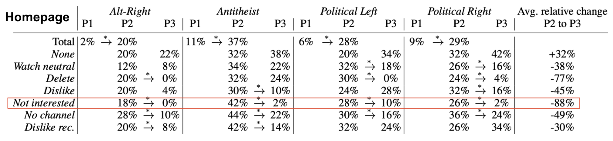

# youtube-burst

## Quick synopsis

Can YouTube users effectively remove unwanted recommendations? We simulated users of a variety of interests and disinterests to answer this question. We then run a user survey to understand how users interact with the features that we tested. 

We find that the "Not interested" button worked best: using this button removed 97% of videos from an unwanted topic on the homepage.  Unfortunately, we estimate from the survey that 44% of the YouTube adult population is unaware that this button exists.

This repository contains code for data collection and analysis related to the project. It is currently under review (Revise and Resubmit) at ICWSM. You can find slides for presentations [here (~5 minutes)](https://docs.google.com/presentation/d/1xPxY9KAEN_cKlmAsYtw5mFL0FOOKX1wAD58GBENwLEU/edit#slide=id.g1fdd7edca8c_0_865) and [here (~40 minutes)](https://docs.google.com/presentation/d/1Tr8CHOl5Ehc8TvKqfdxqDvD67frDe9mRM_j7JEhSUN4/edit#slide=id.g20c8997232a_0_0). Additionally, the paper itself can be found [here](https://www.overleaf.com/read/fptfhdxnxhxv) (conference publication will be linked after acceptance).

## Project overview

Can YouTube users effectively remove unwanted recommendations? We simulated users of a variety of interests and disinterests to answer this question. Broadly, these sock puppets first purposely populate their feed with videos from this unwanted topic ("stain phase"); Then, they take on one of a variety of strategies to try to eliminate such videos from being recommended ("scrub phase"). These strategies correspond to different features on YouTube that one could use to indicate disinterest towards certain videos, such as the "Not Interested" button, the "Dislike" button, and the "Delete from watch history" button. We collect data on how recommendations change throughout these phases in order to characterize how well YouTube's recommendation system responds to these sock puppets' various interactions with the system. 

Data collection pipeline:

This project uses the Selenium web testing software to simulate users. It uses the [undetected-chromedriver](https://github.com/ultrafunkamsterdam/undetected-chromedriver)  package to avoid bot detection. Simulated users are run in parallel in the cloud; the code for this is detailed in a separate [project](https://github.com/carleski/ytburst-terraform), with the help of Rob Carleski. Data is written into Amazon S3.

We run 173 bots total, about 35 at a time in parallel. In total, there were 1k videos watched, 500k recommendations collected (50k of them unique), and bots interacted with the platform for a total of 1k hours (~45 days).

Main finding- the most effective way to remove unwanted content recommendations, out of those we tested, was the "Not interested" button; Using this button removed 97% of videos from an unwanted topic on the homepage:

We then run a user survey on Qualtrics to understand how users interact with the features that we tested. From the user survey, we estimate that 44% of the YouTube adult population is unaware that this button exists:

## Included files

* scrubber.py - class for the sock puppet. It includes code to log into, interact with, collect data from, and watch videos on YouTube
* scrub_main.py - run the experiment by specifying the actions to be performed by the bot during each phase
* seed_data_generation/ - generate the videos that our bots watch during the "stain phase" by querying the YouTube API for videos from selected topics
* analysis/ - analysis script of data after performing manual labeling, answering the research questions of our paper related to sock puppets/bots
* survey/ - data wrangling and analysis related to Qualtrics survey
