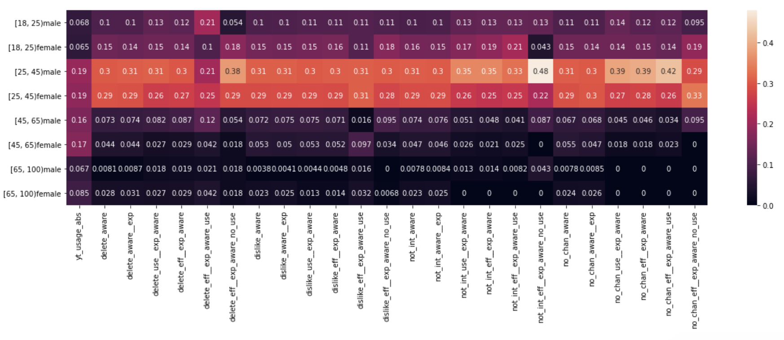

# youtube-burst

## Quick synopsis

Can YouTube users effectively remove unwanted recommendations? We simulated users of a variety of interests and disinterests to answer this question. Our main finding: the most effective way to remove unwanted content recommendations, out of those we tested, was the "Not interested" button: using this button removed 97% of videos from an unwanted topic on the homepage. We then run a user survey on Qualtrics to understand how users interact with the features that we tested. From the survey, we estimate that 44% of the YouTube adult population is unaware that this button exists.

This repository contains code for data collection and analysis related to the project. It is currently under review (Revise and Resubmit) at ICWSM.

## Project overview

Can YouTube users effectively remove unwanted recommendations? We simulated users of a variety of interests and disinterests to answer this question. Broadly, these sock puppets first purposely populate their feed with videos from this unwanted topic ("stain phase"); Then, they take on one of a variety of strategies to try to eliminate such videos from being recommended ("scrub phase"). These strategies correspond to different features on YouTube that one could use to indicate disinterest towards certain videos, such as the "Not Interested" button, the "Dislike" button, and the "Delete from watch history" button. We collect data on how recommendations change throughout these phases in order to characterize how well YouTube's recommendation system responds to these sock puppets' various interactions with the system.

This project uses the Selenium web testing software to simulate users. It uses the [undetected-chromedriver](https://github.com/ultrafunkamsterdam/undetected-chromedriver)  package to avoid bot detection. Simulated users are run in parallel in the cloud; the code for this is detailed in a separate [project](https://github.com/carleski/ytburst-terraform), with the help of Rob Carleski. Data is written into Amazon S3.

Main finding- the most effective way to remove unwanted content recommendations, out of those we tested, was the "Not interested" button: using this button removed 97% of videos from an unwanted topic on the homepage.

[MAIN TABLE with circled row]

We then run a user survey on Qualtrics to understand how users interact with the features that we tested. (TODO).

From the user survey, we estimate that 44% of the YouTube adult population is unaware that this button exists.

## Included files [COMPLETE]

* scrubber.py - class for the sock puppet. It includes code to log into, interact with, collect data from, and watch videos on YouTube
* scrub_main.py - run the experiment by specifying the actions to be performed by the bot during each phase
* seed_data_generation/ - generate the videos that our bots watch during the "stain phase" by querying the YouTube API for videos from selected topics
* analysis/ - analysis script of data after performing manual labeling, answering the RQ's of our paper
* communications/ - TODO

## Musings

### Data Collection

Seed data generation
- files: ./seed_data_generation/
- bots are assigned one of four topics: ABCD
- for each, we start with a csv containing channels of interest. Then, we query the YouTube API for (SETTINGS) videos from each sample. These videos serve as the pool of starting videos for our sock puppets.

Sock puppet data collection pipeline
- files: ./scrub_main.py and ./scrubber.py
- Phases are "stain phase", then "scrub phase"
- (TODO) Diagrams: Algorithm and flowchart

Sock puppet technicalities
- files: communities/, runs/, runner.py, separate [repo](https://github.com/carleski/ytburst-terraform) with Rob Carleski
- sock puppets each have their own Google account, and use Selenium with the undetected-chromedriver package to interact with YouTube and scarpe data, while evading Google restrictions
- uses terraform to create an AWS EC2 swarm, and saves data to AWS S3

### Data Analysis- bots

First pass analysis- 
- incorrect labeling: using the channel lists that exist
- (TODO) cool plot: It looks like some features are better than others!
- (TODO: FORMULA) making a mixed effects logistic regression model, and ranking the coefficients to find the most influential variable (i.e. most effective scrubbing strategies). We see that the "not-interested" strategy works best!
- (TODO) another cool plot: stackplots on the types of categories within the AIN shows that for some strategies, all 
- Next, I estimated the conditional probability that the bot did interact with the system, given that it should have interacted, so that I could understand the efficacy of the startegy

Data labeling- doing it less naively
- Realized in my first pass that data labeling may contain a bias- we were labeling purely by automatic methods (i.e. cross-checking recommendations' channels with our existing channel lists). Considered other labeling options...
- (CODE- Mozilla/) pre-tested the Mozilla model (LINK), and found that their definition of similarity differed from ours
- (CODE- Manual_labeling_12-31/) Decided on a mix of  manual/automatic labeling. Designed and implemented manual labeling pipeline, and estimated my remaining manual data labeling load

Second pass analysis
- After performing my new data labeling, I answered my main RQ's
- e.g. we saw that the "Not interested" button worked best by reducing up to 97% of recommendations from the unwanted topic over time, on average across all topics

Survey analysis
- files: survey/
- Performed post-stratification by matching our survey sample with the adult YouTube population on age/gender breakdowns
- Visualized the difference between my survey sample's population demographic breakdown and that of the general YouTube-using population
- Estimated the post-stratified percentage of those who know about and use different features to remove unwanted recommendations, as well as their percieved efficacy

